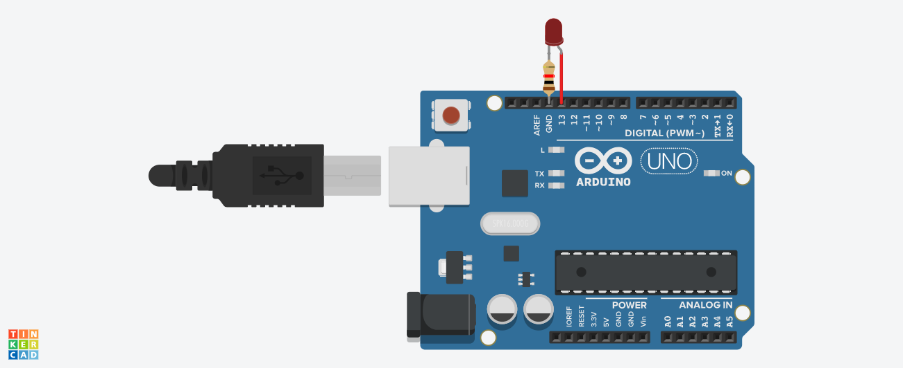

# Practica 1: Encender y apagar un led

## Componentes

* Arduino Uno R3
* LED
* Resistencia 1K

## Funcionamiento

* Se define el pin digital 13 como salida.
* En el loop se realizan las siguientes acciones:
	1. el pin se enciende
	2. se esperan 300ms
	3. el pin se apaga
	4. se esperan 300ms

## Circuito

