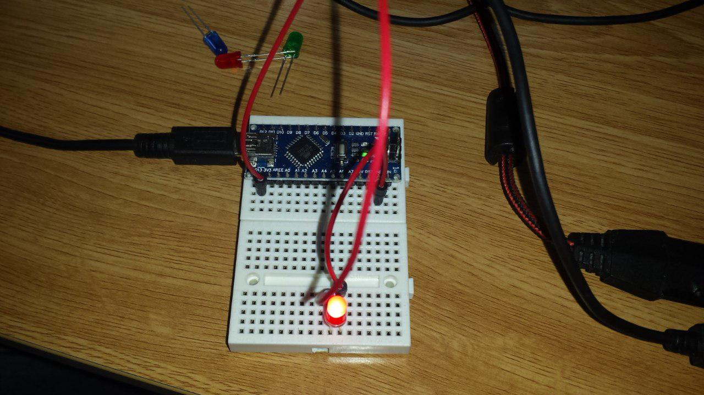

# Practica 1: Encender y apagar un led

## Componentes

* Arduino Uno R3
* 1x LED
* 1x Resistencia 1K
* 2x cables Dupont macho-macho
* Breadboard

## Funcionamiento

* Se define el pin digital 13 como salida.
* En el _loop_ se realizan las siguientes acciones:
	1. el pin se enciende
	2. se esperan 300ms
	3. el pin se apaga
	4. se esperan 300ms

## Circuito

## Foto montaje

