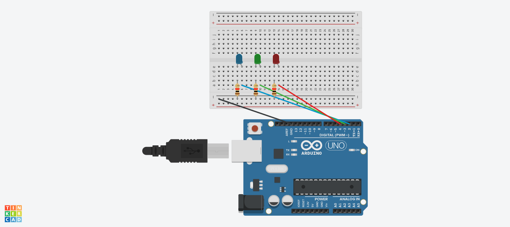

# Practica 2: Encender y apagar 3 leds de forma consecutiva

## Componentes

* Arduino Uno R3
* 3x LED
* 3x Resistencia 1K
* Breadboard
* 4x cables Dupont macho-macho

## Funcionamiento

* Se definen 3 pines digitales como salida.
* En el loop se ejecuta un bucle _for_ que, para cada uno de los 3 pines (LEDs), realiza lo siguiente:
	1. el pin se enciende
	2. se esperan 300ms
	3. el pin se apaga
	4. se esperan 300ms

## Circuito

