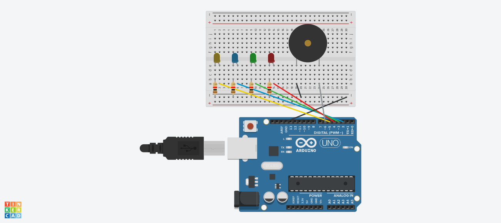
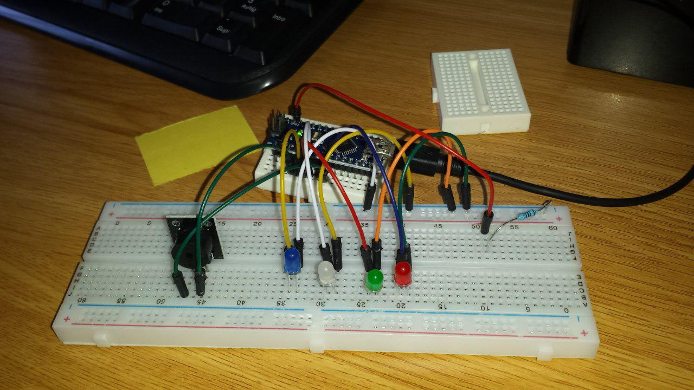

# Practica 3: Encender y apagar 4 leds de forma consecutiva con sonido

## Componentes

* Arduino Uno R3
* 4x LED
* 4x Resistencia 1K
* Buzzer
* Breadboard
* 7x cables Dupont macho-macho

## Funcionamiento

* Se predefine un array con los pines usados para los 4 LEDs.
* Se predefine un array con los tonos que sonarán con cada LED.
* Se definen los 4 pines de los LED como salidas.
* En el _loop_ se ejecuta un bucle _for_ que, para cada uno de los 4 pines (LEDs), realiza lo siguiente:
	1. el pin se enciende
	2. el buzzer suena con el tono designado a ese LED
	3. se esperan 300ms
	4. el pin se apaga
	5. el buzzer deja de sonar
	6. se esperan 300ms

## Circuito

## Foto montaje

