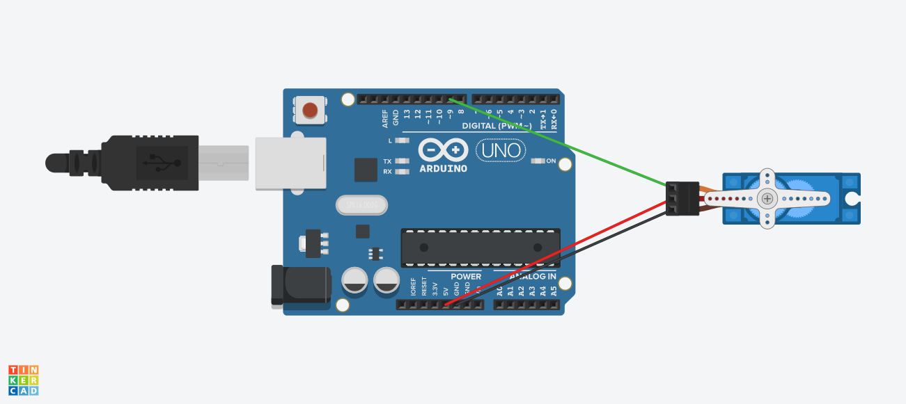
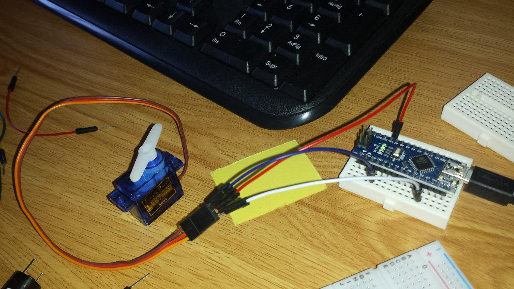

# Practica 4: Mover un servo motor

## Componentes

* Arduino Uno R3
* Servo motor
* 3x cables Dupont macho-macho

## Funcionamiento

* Se importa la librería Servo.h para controlar el servo.
* Se declara un objeto Servo y en el _setup_ se inicializa con el pin de señal del servo (pin digtal 9).
* En el _loop_ se ejecutan dos bucles _for_:
	- bucle 1: utiliza la variable _int angulo_ inicializada a 0, que percorre valores desde 0 y 180 en orden ascendente. En el bucle se actualiza el servo con el valor de _angulo_ en cada momento, y se esperan 25ms entre cada actualización.
	- bucle 2: utiliza la variable _int angulo_ inicializada a 180, que percorre valores desde 180 hasta 0 en orden descendente. En el bucle se actualiza el servo con el valor de _angulo_ en cada momento, y se esperan 25ms entre cada actualización.

El servo rotará completamente hacia un lado y hacia otro en cada ejecución del _loop_, moviéndose a razón de 1º cada 25ms. En el primer bucle, cuando el servo rota por completo hacia un lado, se termina ese bucle y se ejecuta el otro, que rota en sentido contrario hasta volver a la posición original.

## Circuito

## Foto montaje

