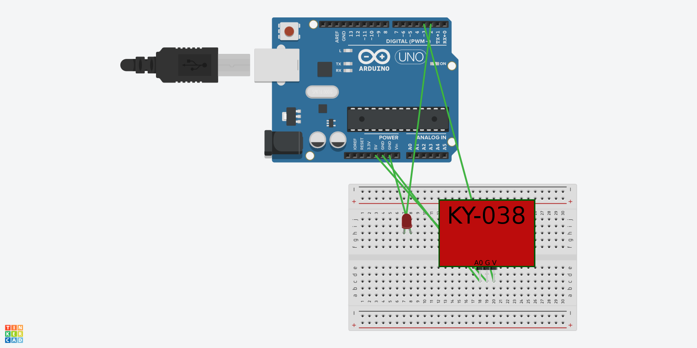
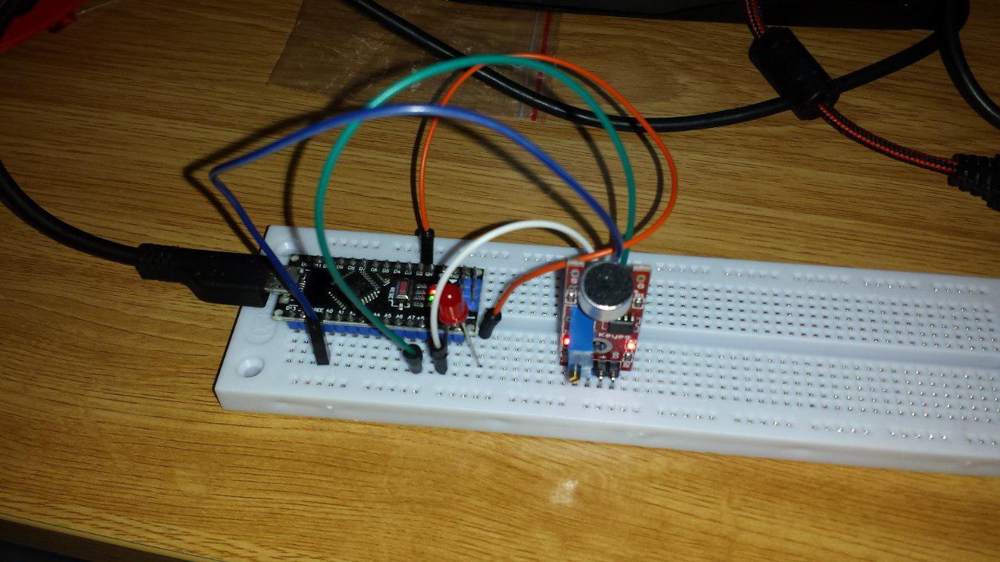

# Practica 5: Clap Switch

## Componentes

* Arduino Nano
* 1x LED
* Sensor sonido "Big Sound" KY-038
* 5x cables Dupont macho-macho
* Breadboard

## Finalidad del proyecto

Encender y apagar un LED dando palmadas.

## Funcionamiento del módulo KY-038

Este módulo se alimenta con 5V y tiene dos salidas, una analógica y otra digital.

La salida analógica es el nivel de sonido instantáneo que detecta el micrófono.

La salida digital por defecto está en nivel bajo. Sube a nivel alto durante un breve período de tiempo cuando el micrófono detecta un valor superior al umbral, que se puede regular ajustando el potenciómetro que incluye la placa del sensor.

Hemos realizado dos versiones del Clap Switch, una usando la salida analógica y otro usando la salida digital. Es preferible usar la salida digital para mejorar la eficiencia del proyecto (se podrían utilizar interrupciones de hardware).

## Funcionamiento usando salida digital

* Se define una variable _bool_ global para guardar el estado del LED (encendido o apagado)
* Se define el pin 2 como salida (LED)
* Se define el pin 3 como entrada digital (salida del módulo)
* En el _loop_ se comprueba si la entrada digital salida del módulo está en nivel alto, en cuyo caso:
	1. La variable _bool_ global cambia de estado
	2. Se cambia el estado de la salida digital del LED al valor de la variable _bool_ global
	3. Se esperan 200ms para evitar que el LED se encienda y apague con una sóla palmada

## Circuito

## Foto montaje

